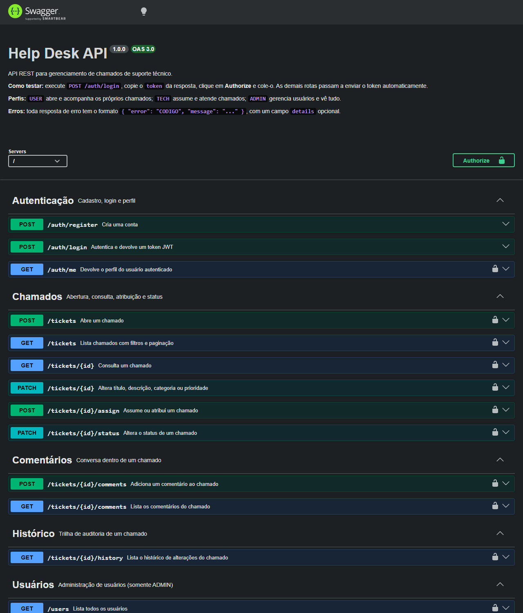
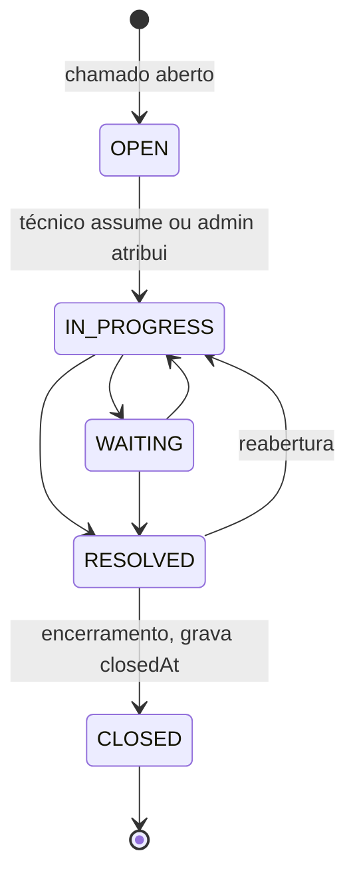
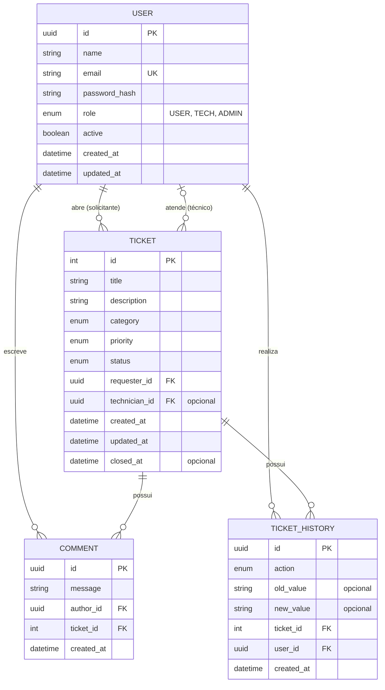

# Help Desk API

API REST para gerenciamento de chamados de suporte técnico. Usuários abrem chamados, técnicos os atendem e administradores gerenciam o sistema, com autenticação JWT, controle de acesso por perfil e histórico completo de cada atendimento.



## Sumário

- [Objetivo](#objetivo)
- [Funcionalidades](#funcionalidades)
- [Tecnologias](#tecnologias)
- [Como executar](#como-executar)
- [Configuração](#configuração)
- [Documentação interativa (Swagger)](#documentação-interativa-swagger)
- [Endpoints](#endpoints)
- [Exemplos de uso](#exemplos-de-uso)
- [Regras de negócio](#regras-de-negócio)
- [Arquitetura](#arquitetura)
- [Modelo do banco](#modelo-do-banco)
- [Testes](#testes)
- [Segurança](#segurança)
- [Limitações e melhorias futuras](#limitações-e-melhorias-futuras)
- [Licença](#licença)

## Objetivo

Projeto de estudo e portfólio, desenvolvido para praticar a construção de um backend completo: modelagem relacional, autenticação, autorização, regras de negócio, tratamento de erros, testes automatizados e empacotamento com Docker.

O domínio escolhido, um help desk, é pequeno o bastante para caber em um projeto individual e rico o bastante para exigir decisões reais: três perfis com permissões diferentes, um fluxo de estados com transições controladas, concorrência entre técnicos e trilha de auditoria.

## Funcionalidades

**Usuário (`USER`)**
- Cadastro e login.
- Abre chamados e acompanha apenas os seus.
- Comenta nos próprios chamados e consulta o histórico de cada um.

**Técnico (`TECH`)**
- Vê os chamados ainda sem responsável e os atribuídos a ele.
- Assume chamados, altera prioridade e categoria, comenta.
- Conduz o atendimento pelo fluxo de status até o encerramento.

**Administrador (`ADMIN`)**
- Vê todos os chamados.
- Cria, altera e desativa usuários; define perfis.
- Atribui e reatribui chamados a técnicos.

**Gerais**
- Histórico de alterações de cada chamado: quem fez, o quê, valor anterior e novo, quando.
- Listagem com filtros (`status`, `priority`, `category`, `technician`) e paginação.
- Respostas de erro padronizadas.
- Documentação interativa com Swagger.

## Tecnologias

| Área | Ferramenta |
|---|---|
| Linguagem e runtime | TypeScript, Node.js 24 |
| Framework HTTP | Express 5 |
| Banco de dados | PostgreSQL 17 |
| ORM e migrations | Prisma 7 |
| Autenticação | JWT (`jsonwebtoken`), senhas com `bcrypt` |
| Validação | Zod |
| Segurança | Helmet, CORS, `express-rate-limit` |
| Documentação | OpenAPI 3 com Swagger UI |
| Testes | Jest, Supertest |
| Infraestrutura | Docker, Docker Compose |

## Como executar

### Com Docker (recomendado)

Pré-requisito: [Docker Desktop](https://www.docker.com/products/docker-desktop/) em execução.

```bash
git clone https://github.com/GhostPacket-cyber/helpdesk-api.git
cd helpdesk-api
cp .env.example .env
```

Edite o `.env` e troque os três valores marcados com `troque`: `POSTGRES_PASSWORD` (e a mesma senha dentro de `DATABASE_URL`), `SEED_USER_PASSWORD` e `JWT_SECRET`. Para gerar um segredo:

```bash
node -e "console.log(require('crypto').randomBytes(48).toString('hex'))"
```

Suba o banco, aplique as migrations e inicie a API:

```bash
docker compose up -d --build
```

Opcionalmente, crie usuários e chamados fictícios:

```bash
docker compose run --rm migrate npm run db:seed
```

A API fica em `http://localhost:3000` e a documentação em `http://localhost:3000/api/docs`.

| Comando | Efeito |
|---|---|
| `docker compose ps -a` | Estado dos serviços |
| `docker compose logs -f app` | Logs da API |
| `docker compose down` | Remove os contêineres, mantendo os dados |
| `docker compose down -v` | Remove também os dados |

### Em desenvolvimento

Banco no Docker e API na máquina, com recarga automática. Pré-requisitos: Node.js 22 ou superior e Docker.

```bash
npm install
docker compose up -d db
npm run db:migrate
npm run db:seed
npm run dev
```

| Script | Efeito |
|---|---|
| `npm run dev` | Inicia a API com recarga automática |
| `npm run build` | Compila o TypeScript para `dist/` |
| `npm start` | Executa a versão compilada |
| `npm test` | Roda os testes |
| `npm run db:migrate` | Cria e aplica migrations |
| `npm run db:seed` | Cria os dados fictícios |
| `npm run db:studio` | Abre o Prisma Studio |

### Usuários do seed

Todos usam a senha definida em `SEED_USER_PASSWORD`.

| Email | Perfil |
|---|---|
| `admin@helpdesk.local` | ADMIN |
| `carlos@helpdesk.local` | TECH |
| `beatriz@helpdesk.local` | TECH |
| `joao@helpdesk.local` | USER |
| `maria@helpdesk.local` | USER |

## Configuração

As variáveis ficam no arquivo `.env`, que não é versionado. O `.env.example` traz o modelo. A aplicação valida todas na inicialização e se recusa a subir se alguma estiver ausente ou inválida.

| Variável | Descrição | Padrão |
|---|---|---|
| `NODE_ENV` | `development`, `test` ou `production` | `development` |
| `PORT` | Porta da API | `3000` |
| `DATABASE_URL` | URL de conexão com o PostgreSQL | obrigatória |
| `JWT_SECRET` | Segredo que assina os tokens, com 32 caracteres ou mais | obrigatória |
| `JWT_EXPIRES_IN` | Validade do token (`1d`, `12h`, `30m`) | `1d` |
| `CORS_ORIGINS` | Sites autorizados a chamar a API pelo navegador, separados por vírgula | vazio |
| `POSTGRES_USER`, `POSTGRES_PASSWORD`, `POSTGRES_DB`, `POSTGRES_PORT` | Usadas pelo Docker Compose para criar o banco | — |
| `SEED_USER_PASSWORD` | Senha dos usuários fictícios | — |

Fora do Docker, a API lê o `.env` e alcança o banco por `localhost`. Dentro do Docker, o arquivo `.env` não entra na imagem: o `docker-compose.yml` injeta as variáveis no contêiner e monta a `DATABASE_URL` com o host `db`.

## Documentação interativa (Swagger)

Com a API no ar, acesse `http://localhost:3000/api/docs`.

1. Execute `POST /auth/login`.
2. Copie o `token` da resposta.
3. Clique em **Authorize** e cole o token.
4. Teste as demais rotas pela própria página.

A especificação OpenAPI crua fica em `/api/docs.json` e pode ser importada no Postman ou no Insomnia.

## Endpoints

| Método | Rota | Acesso | Descrição |
|---|---|---|---|
| GET | `/health` | Público | Estado da API e do banco |
| POST | `/auth/register` | Público | Cria uma conta com perfil USER |
| POST | `/auth/login` | Público | Autentica e devolve o token |
| GET | `/auth/me` | Autenticado | Perfil do usuário logado |
| POST | `/tickets` | USER, ADMIN | Abre um chamado |
| GET | `/tickets` | Autenticado | Lista com filtros e paginação |
| GET | `/tickets/:id` | Quem tem acesso | Consulta um chamado |
| PATCH | `/tickets/:id` | Depende do campo | Altera título, descrição, categoria ou prioridade |
| POST | `/tickets/:id/assign` | TECH, ADMIN | Assume ou atribui o chamado |
| PATCH | `/tickets/:id/status` | Técnico responsável, ADMIN | Altera o status |
| POST | `/tickets/:id/comments` | Quem tem acesso | Adiciona um comentário |
| GET | `/tickets/:id/comments` | Quem tem acesso | Lista os comentários |
| GET | `/tickets/:id/history` | Quem tem acesso | Lista o histórico |
| GET | `/users` | ADMIN | Lista os usuários |
| POST | `/users` | ADMIN | Cria um usuário com qualquer perfil |
| GET | `/users/:id` | ADMIN | Consulta um usuário |
| PATCH | `/users/:id` | ADMIN | Altera nome, email ou perfil |
| PATCH | `/users/:id/status` | ADMIN | Ativa ou desativa |

Parâmetros de `GET /tickets`: `status`, `priority`, `category`, `technician` (UUID), `page` (padrão 1) e `limit` (padrão 20, máximo 100).

## Exemplos de uso

A pasta `requests/` traz corpos JSON prontos. Os exemplos usam `curl`; no PowerShell do Windows, use `curl.exe`.

**Login**

```bash
curl -X POST http://localhost:3000/auth/login \
  -H "Content-Type: application/json" \
  -d '{"email":"joao@helpdesk.local","password":"<SEED_USER_PASSWORD>"}'
```

```json
{
  "token": "eyJhbGciOiJIUzI1NiIsInR5cCI6IkpXVCJ9...",
  "user": {
    "id": "3f2b7c1e-8a4d-4e2b-9c6f-1d5a7b9e0c12",
    "name": "João Usuário",
    "email": "joao@helpdesk.local",
    "role": "USER",
    "active": true
  }
}
```

**Abrir um chamado**

```bash
curl -X POST http://localhost:3000/tickets \
  -H "Authorization: Bearer <token>" \
  -H "Content-Type: application/json" \
  -d @requests/ticket-create.json
```

```json
{
  "id": 15,
  "title": "Monitor não liga",
  "category": "HARDWARE",
  "priority": "MEDIUM",
  "status": "OPEN",
  "closedAt": null,
  "requester": { "id": "3f2b7c1e-...", "name": "João Usuário", "email": "joao@helpdesk.local" },
  "technician": null
}
```

**Listar com filtros**

```bash
curl "http://localhost:3000/tickets?status=OPEN&priority=HIGH&page=1&limit=10" \
  -H "Authorization: Bearer <token>"
```

```json
{
  "data": [],
  "meta": { "page": 1, "limit": 10, "total": 0, "totalPages": 0 }
}
```

**Histórico de um chamado**

```bash
curl http://localhost:3000/tickets/15/history -H "Authorization: Bearer <token>"
```

```json
[
  { "action": "CREATED", "oldValue": null, "newValue": null, "description": "Chamado criado por João Usuário" },
  { "action": "ASSIGNED", "oldValue": null, "newValue": "Carlos Técnico", "description": "Chamado assumido pelo técnico Carlos Técnico" },
  { "action": "STATUS_CHANGED", "oldValue": "OPEN", "newValue": "IN_PROGRESS", "description": "Status alterado de OPEN para IN_PROGRESS" }
]
```

**Formato de erro**

Toda resposta de erro tem `error` (código estável) e `message`. Alguns erros trazem `details`.

```json
{
  "error": "INVALID_STATUS_TRANSITION",
  "message": "Não é possível alterar o status de IN_PROGRESS para CLOSED.",
  "details": { "from": "IN_PROGRESS", "to": "CLOSED", "allowed": ["WAITING", "RESOLVED"] }
}
```

| Código HTTP | Uso |
|---|---|
| 200, 201 | Sucesso, recurso criado |
| 400 | Dados inválidos |
| 401 | Não autenticado |
| 403 | Autenticado, mas sem permissão |
| 404 | Recurso não encontrado |
| 409 | Conflito com o estado atual do recurso |
| 413 | Corpo da requisição grande demais |
| 429 | Limite de tentativas excedido |
| 500, 503 | Erro interno, banco indisponível |

## Regras de negócio

**Visibilidade dos chamados**

| Perfil | Enxerga |
|---|---|
| USER | Os chamados que abriu |
| TECH | Os sem técnico e os atribuídos a ele |
| ADMIN | Todos |

Comentários e histórico seguem a mesma regra do chamado a que pertencem.

**Fluxo de status**



- Um chamado novo começa como `OPEN`, com prioridade `MEDIUM` e sem técnico.
- Receber um técnico leva o chamado para `IN_PROGRESS`.
- Só o técnico responsável ou um ADMIN altera o status.
- `CLOSED` é definitivo: não aceita novo status, edição, atribuição nem comentário.
- Se dois técnicos tentam assumir o mesmo chamado ao mesmo tempo, apenas um consegue; o outro recebe `409`.

**Edição de um chamado**

| Quem | Campos |
|---|---|
| Solicitante, com o chamado ainda `OPEN` | título, descrição |
| Técnico responsável | categoria, prioridade |
| ADMIN | todos |

**Usuários**

- O cadastro público sempre cria o perfil `USER`.
- Usuários não são apagados, apenas desativados. Um usuário desativado não faz login, e seus tokens deixam de valer imediatamente.
- Um administrador não pode desativar a própria conta nem alterar o próprio perfil.

## Arquitetura

Arquitetura em camadas. Cada requisição atravessa as camadas em uma única direção, e cada camada tem uma responsabilidade.

```
Requisição HTTP
   ↓
Route        liga a URL e o verbo à cadeia de middlewares e ao controller
   ↓
Middlewares  autenticação (JWT), autorização (perfil), validação da entrada
   ↓
Controller   traduz HTTP em chamada de service, e o resultado em resposta
   ↓
Service      regras de negócio e permissões por recurso
   ↓
Repository   acesso ao banco e transações
   ↓
PostgreSQL
```

```
src/
├── config/         variáveis de ambiente, cliente do Prisma
├── controllers/    entrada e saída HTTP
├── docs/           especificação OpenAPI
├── errors/         AppError
├── middlewares/    authenticate, authorize, validate, rateLimiter, errorHandler
├── repositories/   consultas e transações
├── routes/         definição das rotas
├── services/       regras de negócio
├── types/          extensão dos tipos do Express
├── validators/     schemas do Zod
├── app.ts          montagem do Express
└── server.ts       inicialização e encerramento
prisma/             schema, migrations e seed
tests/              testes de integração
```

Decisões que valem destaque:

- **Erros centralizados.** Qualquer camada lança um `AppError`; um único middleware o converte em resposta. Erros inesperados viram `500` genérico, e o detalhe fica apenas no log.
- **Histórico transacional.** Cada alteração de um chamado e o seu registro de histórico são gravados na mesma transação: ou os dois acontecem, ou nenhum.
- **Atualizações condicionais.** Assumir um chamado e mudar o status usam `UPDATE ... WHERE` com o estado esperado, o que evita que duas requisições simultâneas se sobrescrevam.
- **Senha nunca exposta.** O hash é omitido de todas as consultas por configuração global do Prisma; apenas o login o solicita.
- **Permissões consultadas no banco.** O perfil usado na autorização vem do banco a cada requisição, não do token, então mudanças de perfil e desativações valem na hora.

## Modelo do banco



| Enum | Valores |
|---|---|
| Perfil | `USER`, `TECH`, `ADMIN` |
| Status | `OPEN`, `IN_PROGRESS`, `WAITING`, `RESOLVED`, `CLOSED` |
| Prioridade | `LOW`, `MEDIUM`, `HIGH`, `CRITICAL` |
| Categoria | `HARDWARE`, `SOFTWARE`, `NETWORK`, `ACCESS`, `PRINTER`, `OTHER` |
| Ação do histórico | `CREATED`, `ASSIGNED`, `STATUS_CHANGED`, `PRIORITY_CHANGED`, `COMMENT_ADDED`, `UPDATED` |

Usuários têm id UUID; chamados têm id numérico sequencial, para serem citados como "chamado #15".

## Testes

Testes de integração com Jest e Supertest: cada teste faz requisições HTTP reais à aplicação, passando por todas as camadas até o banco.

```bash
docker compose up -d db
npm test
```

- Rodam em um banco separado (`helpdesk_test`), criado e migrado automaticamente. Os dados de desenvolvimento não são tocados.
- O banco é esvaziado antes de cada teste, então nenhum depende de outro.

O que é coberto:

| Arquivo | Assunto |
|---|---|
| `auth.test.ts` | Cadastro, login correto e incorreto, acesso sem token, token adulterado, usuário desativado |
| `permissions.test.ts` | O que cada perfil pode e não pode fazer |
| `tickets.test.ts` | Criação, visibilidade entre usuários, filtros e paginação |
| `ticket-workflow.test.ts` | Atribuição, concorrência entre técnicos, transições de status, encerramento, histórico |
| `comments.test.ts` | Conversa no chamado e controle de acesso |

## Segurança

- Senhas armazenadas apenas como hash bcrypt.
- JWT com validade e algoritmo fixo (HS256); tokens adulterados ou com outro algoritmo são recusados.
- Mesma resposta, e mesmo tempo de resposta, para email inexistente e senha incorreta.
- Validação de corpo, query string e parâmetros de URL em todas as rotas.
- Rotas protegidas por padrão; campos controlados pelo sistema (perfil, solicitante, status) nunca são aceitos do cliente.
- Limite de tentativas de login e de cadastros por endereço IP.
- Helmet para cabeçalhos de segurança e CORS restrito às origens configuradas.
- Tamanho máximo de 100 KB para o corpo das requisições.
- Segredos somente em variáveis de ambiente; a aplicação não inicia com o segredo de exemplo.
- Imagem Docker em dois estágios, sem ferramentas de desenvolvimento, executada por usuário sem privilégios.

## Limitações e melhorias futuras

Limitações conhecidas:

- A API fala HTTP puro; em produção deve ficar atrás de um proxy reverso com HTTPS.
- O contador do limite de tentativas fica em memória: zera ao reiniciar e não é compartilhado entre instâncias.
- Não há renovação de token (*refresh token*); ao expirar, é preciso fazer login de novo.
- A especificação OpenAPI é escrita à mão e pode divergir do código se não for mantida.
- `npm audit` aponta vulnerabilidades em dependências internas do Prisma CLI, ferramenta de desenvolvimento que não faz parte da imagem de produção.

Melhorias planejadas:

- Integração contínua com GitHub Actions, rodando os testes a cada *push*.
- Gerar a especificação OpenAPI a partir dos schemas do Zod.
- *Refresh tokens* e troca de senha.
- Painel de indicadores para o administrador (chamados por status, tempo médio de atendimento).
- Notificações por email a cada mudança de status.
- Anexos nos chamados.
- Logs estruturados e identificador de requisição.
- Frontend consumindo a API.

## Licença

Distribuído sob a licença MIT. Veja [LICENSE](LICENSE).
